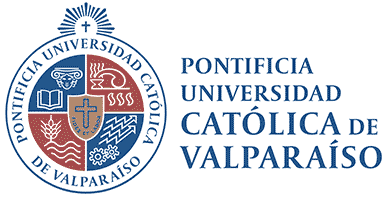
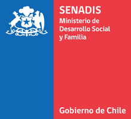
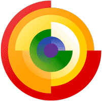
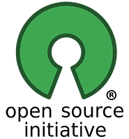

# Pictogramas: Repositorio de desarrollo

Este es el repositorio de desarrollo de los **[Pictogramas](https://www.github.com/accesibilidad-inclusion/pictogramas)**, una librería de software y un sistema gráfico diseñado para componer pictogramas que apoyan la accesibilidad cognitiva en servicios públicos. 

<a href="https://liberapay.com/accesibilidad-inclusion/donate"></a>

### Estructura de directorios

- `/src`: carpeta de archivos fuente, editables y archivos exportados, sin optimizar
- `/dist`: carpeta de íconos exportados y optimizados para su uso en [Pictogramas](https://www.github.com/accesibilidad-inclusion/pictogramas)

Ejecutar: 

`gulp pictos`

para optimizar los pictogramas y copiarlos a la carpeta `/dist` 

### Estructura del Manifest

``` JSON
{
  "layer": 1,
  "path": "foobar.svg",
  "label": "lorem ipsum dolor sit amet",
  "type": "action|object|context",
  "tags": [ "foo", "bar", "quick brwn fox"]
}
```

#### Créditos

Este proyecto es fruto del trabajo de muchas personas y el apoyo de diversas iniciativas:

##### Autores
Pictogramas (inicialmente "PICTOS") fue el proyecto de Titulación de Diseño Gráfico de Antonella Pastén y María Ignacia von Unger. Profesores Herbert Spencer, Katherine Exss y Vanessa Vega. e[ad] Escuela de Arquitectura y Diseño PUCV. Este proyecto sigue en crecimiento y es mantenido por el [Núcleo de Investigación en Accesibilidad e Inclusión PUCV](http://www.accesibilidad-inclusion.cl).

##### Instituciones

1. **Pontificia Universidad Católica de Valparaíso** mediante los proyectos:
  - I2: Investigación Inclusiva: Oportunidades para fortalecer la autodeterminación en la era digital (2017)
  -  I3: Investigación, Innovación e Inclusión en la PUCV (2018)
2. **Servicio Nacional de la Discapacidad, SENADIS**
  - Apoyos Visuales para la Plena Inclusión de las Personas con Discapacidad Intelectual en los Servicios Públicos en Chile (2019-2020)

|  |  |  |  |
|----------------------------------------------------------------------|------------------------------------|------------------------------------------------|----------------------------------------------|
